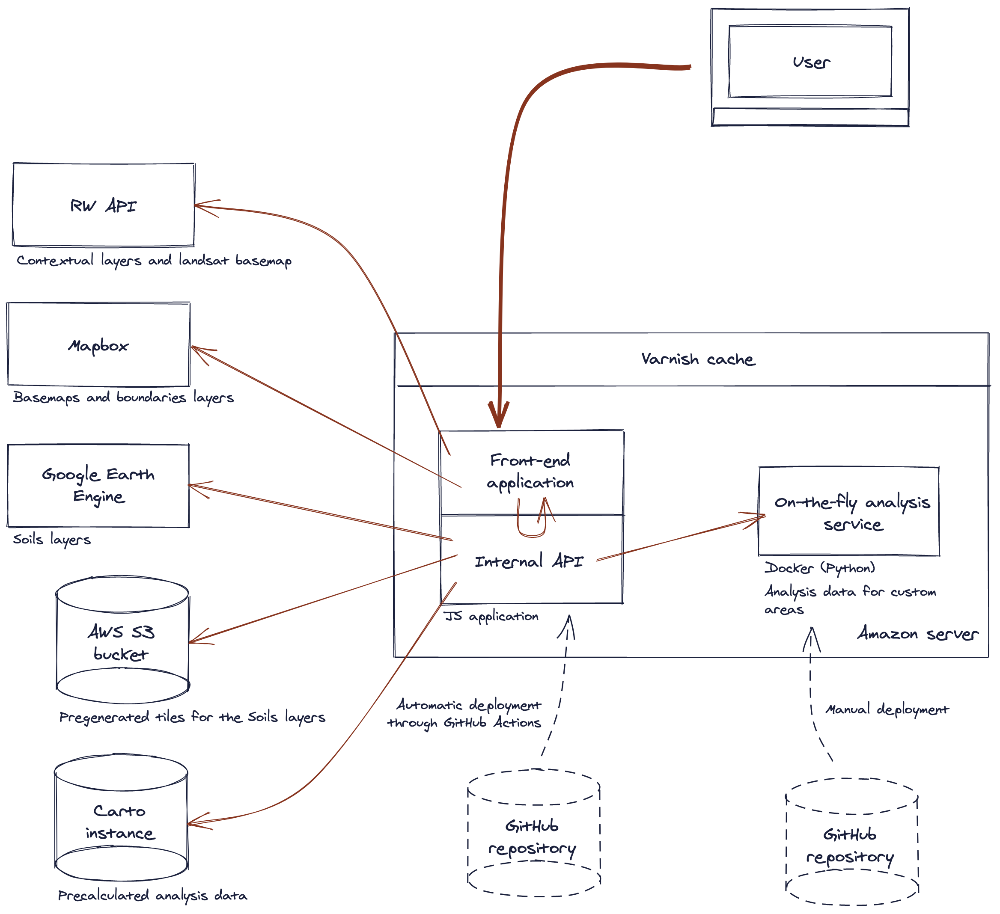

# soils-revealed

Platform for direct visualization, analysis and reporting of soil organic carbon predictions and changes over time.


You can check the production instance here: [soilsrevealed.org](https://soilsrevealed.org/).

## Getting Started

In order to start modifying the app, please make sure to correctly configure your workstation:

1. Make sure you you have [Node.js](https://nodejs.org/en/) installed
2. (Optional) Install [NVM](https://github.com/nvm-sh/nvm) to manage your different Node.js versions
3. (Optional) Use [Visual Studio Code](https://code.visualstudio.com/) as a text editor to benefit from automatic type checking
4. Configure your text editor with the [Prettier](https://prettier.io/), [ESLint](https://eslint.org/) and [EditorConfig](https://editorconfig.org/) plugins
5. Use the correct Node.js version for this app by running `nvm use`; if you didn't install NVM (step 2), then manually install the Node.js version described in `.nvmrc`
6. Install the dependencies: `yarn`
7. Create a `.env` file at the root of the project by copying `.env.default` and giving a value for each of the variables (see next section for details)
8. Create a gee.key.json file at the root of the project with the Google Earth Engine's private key inside.

9. Run the server: `yarn dev`

You can access a hot-reloaded version of the app on [http://localhost:3000](http://localhost:3000).

The application is built using [React](https://reactjs.org/) and the framework [Next.js](https://nextjs.org/). The styles use [Sass](https://sass-lang.com/) and the [Bootstrap](https://getbootstrap.com/) framework.

A continuous deployment system is in place. Each time you push to the `master` branch, the application is deployed to production. Github will trigger an event on google cloud run and make a deployment. The same for the `develop` branch.

## Environment variables

The application (and API) is configured via environment variables stored in a `.env` file that must be placed at the root of the project. You can create one by copying `.env.default` and setting a value for each key.

Below is a description of each of the keys.

| Variable | Description |
|---|---|
| PORT | Port number used by the application |
| MAPBOX_API_KEY | Mapbox API key for the Explore page |
| API_URL | URL of the Carto instance providing the pre-calculated analysis |
| ANALYSIS_API_URL | URL of the on-the-fly analysis service |
| DEPLOYMENT_KEY | (Optional) Key generated at deployment time to bypass the cache of the Carto instance |
| AWS_REGION | [Region](https://docs.aws.amazon.com/general/latest/gr/s3.html) of the AWS S3 bucket storing the tiles of the soils layers |
| AWS_BUCKET_NAME | Name of the AWS S3 bucket storing the tiles of the soils layers |
| AWS_ACCESS_KEY_ID | Access key ID of the AWS server storing the tiles of the soils layers |
| AWS_SECRET_ACCESS_KEY | Secret access key of the AWS server storing the tiles of the soils layers |
| AWS_MAX_Z_TILE_STORAGE | Maximum zoom at which tiles generated on-the-fly will be saved in the AWS S3 bucket |

## Deployment

### Local computer

It is possible to run a local test deployment using the docker image. Docker implement an agnostic build and then during run it will pickup the container's env variables, and properly set the system

`run.sh` accepts 2 arguments: production or develop. Production argument will run `yarn start` and the code will production ready, while `develop` runs nodejs in development mode, necessary if you are testing content and changes.

```bash
docker build --force-rm --no-cache -t soils-revealed:latest .
docker run -p3001:3001 --env-file .env soils-revealed:latest /soils-revealed/run.sh production
```

**Note:** We have created a `.env` file on the project root with all variables, and this will be used to run nodejs in production mode. This is a deployment to test nodejs in production mode.  

**Note:** Dockerfile has `CMD` implementing production.


### Google GKE

Public deployment is based on Google Cloud build and file `.cloudbuild.yaml`. Up on push to `master` or `develop`, the following steps will happen:

1. Github will trigger a Google Cloud run trigger
2. Google cloud will pull the branch content.
3. Docker build will be iniciated, using `Dockerfile` and `.cloudbuild.yaml`  
4. After completed Docker image is stored on a private repository, using tags `latest` and `$SHORT_SHA`
5. Google Cloud build will update the image on GKE and make a `kubectl rollout restart`
6. GKE contains a specific `ConfigMap` with all .env necessary for deployment.
7. `gee.key.json` is added to the pods using a `ConfigMap` mount
 

Overall, deploying to either environment takes between 5 to 10 minutes to complete. If deployment is not successful GKE will continue implementing the previous deployment.

## Architecture



The platform is hosted on an Amazon server and consists of two main applications:

- the web server
- the on-the-fly analysis service

The web server is a Node.js application made out of two elements: the Next.js server and an API the server relies on for all of its non-cartographic data (e.g. analysis data) and some of its cartographic data (e.g. the soils layers).

The API is an abstraction that obfuscates some sensitive information like the Google Earth Engine key, and that abstracts complex data handling.

In addition to the API, the front-end also accesses the [RW API](http://api.resourcewatch.org/) and a Mapbox account, from which it gets map layers.

Similarly, the API accesses other services too: a Carto instance which provides all of the precalculated analysis data, a service which provides on-the-fly analysis for custom areas (hosted with the web server), and a Google Earth Engine (GEE) account and an Amazon Web Services (AWS) S3 bucket which provide the soils layers.

When soils layers are requested, the API tries to fetch the tiles for the AWS S3 bucket first. If they can't be found, it fallbacks to GEE to generate them dynamically. Depending on the zoom level, these tiles may then be saved in the bucket so the API can respond faster the next time.

Between the user and the web server lies a cache, [Varnish](https://varnish-cache.org/), which ensures frequent and similar API requests are computely cheap and resolving fast.

Finally, the code of the web server (front-end application and API) is hosted on this GitHub repository, while the code of the on-the-fly analysis service is [hosted on this one](https://github.com/Vizzuality/soils-revealed-lambda).

_**Note about the schema**: the schema was created with [Excalidraw](https://excalidraw.com/). In the `/docs/assets` folder, you will find a `architecture-schema.excalidraw` file. If you wish to edit the schema, re-open this file in the Excalidraw website. Don't forget to save your changes and store the `.excalidraw` file in the repository._
